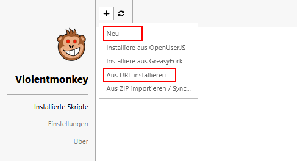

# Unofficial-TR-Document-Batch-Downloader-for-Firefox
This violentmonkey script for Firefox enables a batch download for documents from traderepublic.com. This is an unofficial and private script. I am not affiliated with Trade Republic in any way.

# violentmonkey
To use this script, you need the browser extentension [Violentmonkey](https://violentmonkey.github.io/). This extension allow the execution of user scripts.

## Content

- [Userscript Manager](#userscript-manager)
- [Scripts](#scripts)
  - [Download documents from postbox - ing.de](#download-documents-from-postbox---ingde)

## Userscript Manager

Install Violentmonkey from [github.io](https://violentmonkey.github.io/).

## Scripts

Open the Violent Monkey Dashboard.

To add a new script, click on the + button.

Select *Install from URL* and paste the link to the raw file or select *New* and copy and paste the script code and hit *Save & Close*.

After successful installation reload the page in question.

